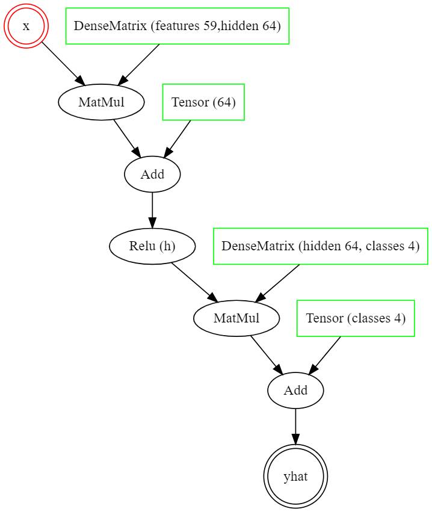

# :zap: Basic concepts

For demonstration purposes, we will create a custom model to make predictions 
on the Lymphography dataset. This implements the following:

1. [Dataset loading](#dataset-loading)
2. [Model definition](#model-definition)
3. [Training](#training)
4. [Testing](#testing)

Code snippets are organized into an [introduction.java](../JGNN/src/examples/Introduction.java) file.

# Dataset loading
First, we load the dataset (it is automatically downloaded) and use the `IdConverter` class
to get label and feature matrices. To save memory, these are sparse. 
Matrices could also be programmatically generated in either sparse or dense form (according 
to memory vs speed considerations) with primitive operations.
Let's set dimension names to force logical integrity checks of arithmetic operations
(`null` names can match anything), for example during matrix addition or multiplication.

```java
Dataset dataset = new Datasets.Lymphography();
IdConverter nodeIdConverter = dataset.nodes();
Matrix labels = nodeIdConverter.oneHot(dataset.getLabels()).setDimensionName("samples", "classes");
Matrix features = nodeIdConverter.oneHot(dataset.getFeatures()).setDimensionName("samples", "features");
```

:bulb: To maintain the same naming convention between traditional and graph neural networks, 
data samples are refferred to as *nodes* .

# Model definition
We first retrieve the number of features and class labels that will help us define our model. Note 
that matrix dimensions and elements are `long` numbers. Dense matrices can only
store up to MaxInt, but this convention makes large sparce matrices interoperable.

```java
long numFeatures = features.getCols();
long numClasses = labels.getCols();
```

We define a model using the library's symbolic builder class. This
has four important methods: 
<br>a) `var` to define inputs
<br>b) `config` to define hyperparameters
<br>c) `operation` to parse symbolic operations
<br>d) `out` to define output variables

We can retrieve the defined model at anytime with the builder's `getModel()` method. 
Until that point, models are incrementally constructed with functional programming.
For our example, we define a two-layer perceptron, with a relu hidden layer and 
a row-wide softmax activation. Learnable matrices and vectors could be defined manually,
but in this example we automatically generate them. The number of
hidden dimensions (64 right now) could also have been set as a hyperparameter. 
`@` corresponds to matrix multiplication.

```java
ModelBuilder modelBuilder = new ModelBuilder()
	.config("feats", numFeatures)
	.config("labels", numClasses)
	.config("reg", 1.E-5)
	.var("x")
	.operation("h = relu(x@matrix(feats, 64, reg)+vector(64))")
	.operation("yhat = softmax(h@matrix(64, labels)+vector(labels), row)")
	.out("yhat")
	.assertBackwardValidity();
```

In addition to normal syntax checks, the last method call asserts that all operations
are eventually used by outputs, creating an error message otherwise. 
To further check up on the architecture, let's extract its execution graph in *.dot* format
by writting:

```java
System.out.println(modelBuilder.getExecutionGraphDot());
```

Copying-and-pasting the outputted description to [GraphvizOnline](https://dreampuf.github.io/GraphvizOnline/) creates the following visualization
of the execution graph:



# Training
To train the model, we set up 50-25-25 training-validation-test data slices.
These basically handle shuffled sample identifiers. You can use integers instead of
doubles in the `range` method to reference a fixed fixed instead of fractional slice sizes.

```java
Slice samples = dataset.nodes().getIds().shuffle();
Slice train = samples.range(0, 0.5);
Slice valid = samples.range(0.5, 0.75);
Slice test = samples.range(0.75, 1);
```

Next, we set up create a treaning strategy given an Adam optimizer, 
a binary cross-entropy loss, and validation loss patience of 100 epochs:


```java
Optimizer optimizer = new Adam(0.1);

ModelTraining trainer = new ModelTraining()
	.setOptimizer(optimizer)
	.setLoss(new BinaryCrossEntropy())
	.setEpochs(3000)
	.setPatience(100);
```

Finally, we train the model under this strategy by initializing its parameters 
and calling the optimizer:

```java
model
	.init(new XavierNormal())
	.train(optimizer, features, labels, train, valid);
```

:bulb: Real-world settings can further separate rows of the test set first without using 
more memory, but we keep things simple here.


# Testing
We finally report training accuracy on the test set. We demonstrate how single-sample predictions can be
made and measure the accuracy of those. To do this, we use `Matrix.accessRow` to obtain specific matrix rows from node features as tensors and `Tensor.asRow` to convert the obtained tensors into a row representation. Row representations are matrices and can pass through the model just fine. 
We use `argmax` to convert one-hot predictions to label ids.

```java
double acc = 0;
for(Long node : test) {
	Matrix nodeFeatures = features.accessRow(node).asRow();
	Matrix nodeLabels = labels.accessRow(node).asRow();
	Tensor output = model.predict(nodeFeatures).get(0);
	acc += (output.argmax()==nodeLabels.argmax()?1:0);
}
System.out.println("Acc\t "+acc/testIds.size());
```

[NEXT: Neural networks](NN.md)